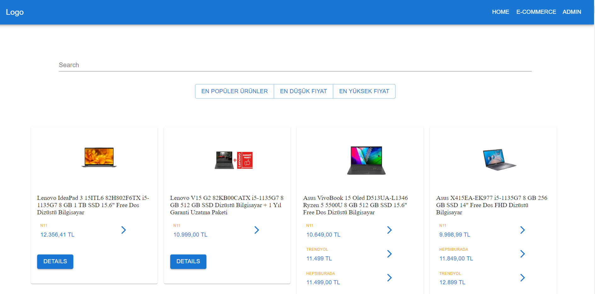
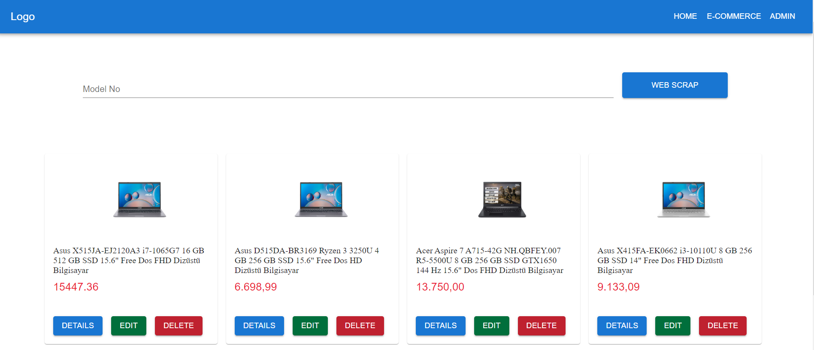

# E-Commerce "Cimri.com Copycat"


The app consists of 3 main parts. First one is a Cimri.com copycat website categorized in laptops. It basicly webscrape 4 diffrent websites and compare the results together to get the a unique laptop with diffrent sellers. Filtering the products was achived here by price. The user can dynamiclly search for a laptop or amodel number from the search bar and the result will be live as writing. Second Part is a normal E-commerce website that is taking the data from the admin section "Third Part". [Preview](https://webscrapingcimri.netlify.app/)

## Table of contents

  

-  [Overview](#overview)

-  [Screenshot](#screenshot)

-  [Links](#links)

-  [Built with](#built-with)

## Overview

### The challenge

Users are able to:

  

- Search for specific laptop with live preview

- See all diffrent sellers for one laptop

- See other products made by admin in E-Commerce Section.

- Search online for a laptop and gets the specific laptop with all diffrent sellers in Admin Section. (Beta)

- See the details for every laptop listed in the website.
- Admin can edit the products on the E-Commerce Section


### Screenshot
Descending Filtering by price

E-Commerce Section

Admin Section


## Installation

Use npm package manager to install Used Packages in both backend and frontend directories.

```bash
npm i
```

In the frontend directory run:

```bash
npm start
```
In the backend directory run:

```bash
node server.js
```


### Links

- Live Site URL: [Preview](https://webscrapingcimri.netlify.app/)
- LinkedIn - [Mohamed Hosam](https://www.linkedin.com/in/m4hosam/)

## My process

### Built with

- React JS
- Semantic HTML5 markup
- CSS custom properties
- CSS Grid
- MongoDB as a Database
- Node.js Back-end JavaScript runtime environment 
- Puppeteer as library for web scraping
- Express js Back-end web application framework for Node.js

- Mongoose connection between MongoDB and the Express web application framework.


